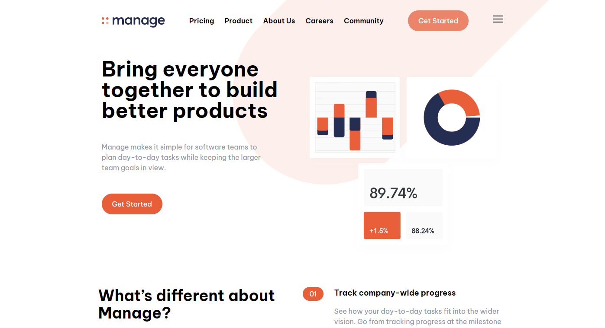

# Frontend Mentor - Manage Landing Page solution

This is a solution to the [Stats preview card component challenge on Frontend Mentor](https://www.frontendmentor.io/challenges/stats-preview-card-component-8JqbgoU62).

## Table of contents

- [Overview](#overview)
  - [The challenge](#the-challenge)
  - [Screenshot](#screenshot)
  - [Links](#links)
- [My process](#my-process)
  - [Built with](#built-with)
  - [What I learned](#what-i-learned)
  - [Continued development](#continued-development)
  - [Useful resources](#useful-resources)
- [Author](#author)

## Overview

### The challenge

Users should be able to:

- View the optimal layout depending on their device's screen size
- See hover states for interactive elements

### Screenshot

### Links

- Solution URL: [GitHub](https://github.com/arnold-ryan/manage-landing-page-master)
- Live Site URL: [Live Site](https://arnold-manage.netlify.app/)

## My process

### Built with

- Mobile-First Approach
- Semantic HTML5 markup
- CSS custom properties
- Flexbox
- Tailwind CSS

### What I learned

Using web responsive images can be tricky especially because I wasn't using the mobile-first workflow. I had to lookup:

- how to animate hamburger button on click
- how to add JavaScript functionality for interactivity

### Continued development

I'd like to continue learning and adapting to how to use svg images and how to adjust them with custom css.

### Useful resources

- [Stack Overflow](https://stackoverflow.com/questions/3120739/resizing-svg-in-html) - helped me with resizing svg image filters
- [codepen](https://codepen.io/designcouch/pen/ExvwPY) - creating mobile responsive hamburger menu

## Author

- Website - [Arnold Odhiambo](https://arnold-portfolio.netlify.app)
- Frontend Mentor - [@arnold-ryan](https://www.frontendmentor.io/profile/arnold-ryan
- LinkedIn - [Arnold Odhiambo](https://www.linkedin.com/in/arnold-odhiambo-dev/)
